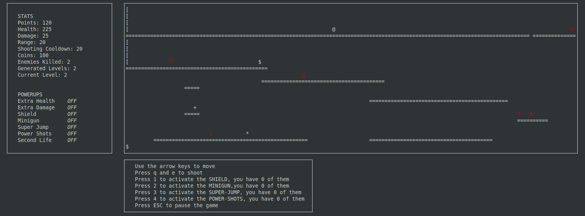

# 2D Platform Game with ASCII graphics

Programming project for uni.



## GENERAL DESCRIPTION

Platform game with ASCII graphics developed using the ncurses library. The objective of the game is to acquire points by progressing through the levels or by killing various types of enemies.

During the game the player can collect coins around the map which can be used to purchase powerups in the shop. The shop can only be accessed at the start of the game.

The initial difficulty of the game is chosen based on the powerups currently purchased and it increases as you progress through the levels.

When the player's life drops to 0, they can choose whether to exit the game or start a new game while keeping coins and power-ups.

### Enemies

- (#) : traps around the map, if you step on them you lose HP
- (T) : they can only shoot and they can't move
- (O) : they can only move and they can't shoot
- (&) : they can both shoot and move

### Powerups

- Extra Health
- Extra Damage
- Shield
- Minigun
- Super Jump
- Power Shots
- Second Life

### Pickups

- ($) : coins, it gives +100 coins
- (+) : HP up, it gives +100 HP
- (*) : freeze, it blocks every enemy for 4 seconds

## To compile and run the game

```bash
make run
```
